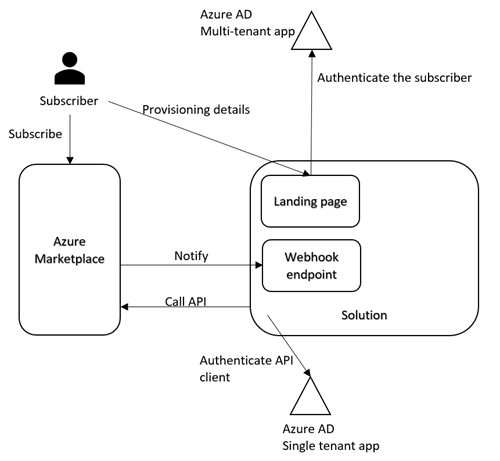
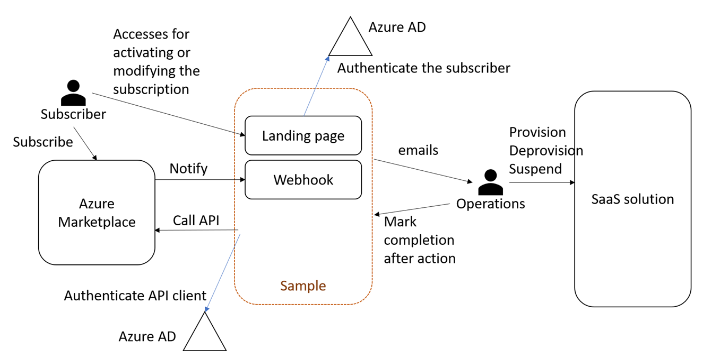
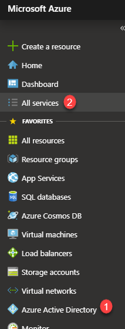
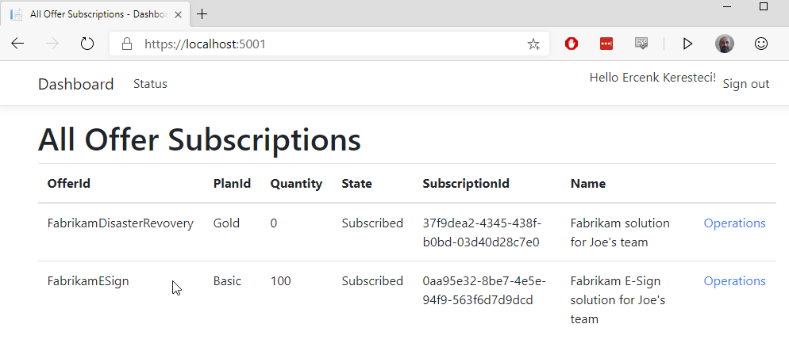
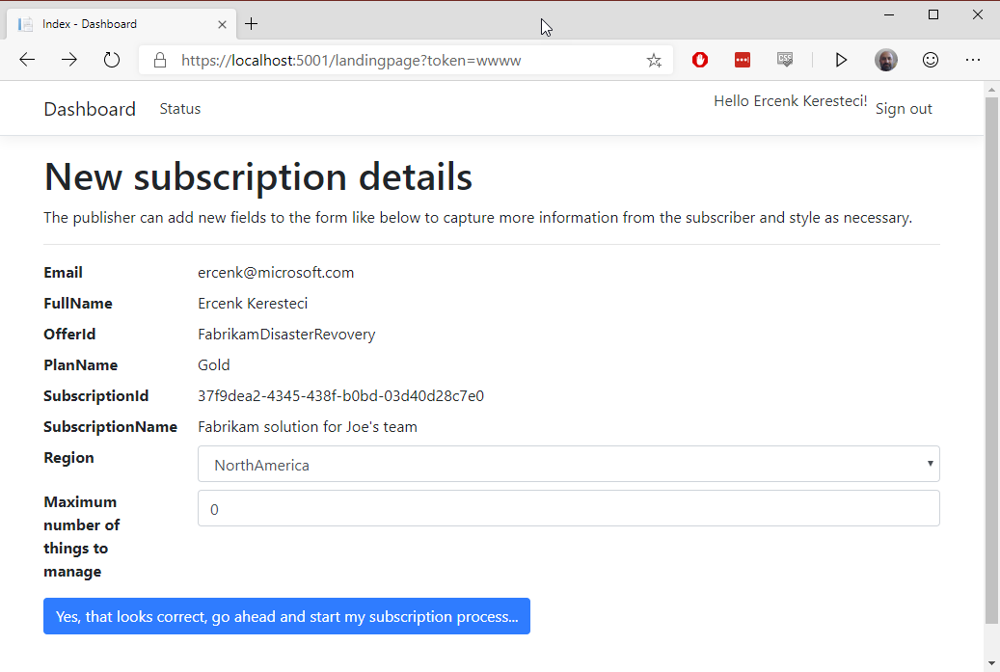

# A sample for Azure Marketplace SaaS integration

This sample demonstrates the basic interaction of a SaaS solution with Azure Marketplace. It does not have any SaaS functionality, however it is a bare bones approach focusing on the marketplace integration.

First, disclaimers :)

- **My intent with this sample is to demonstrate the integration concepts, and highlight a possible solution that may address a common scenario.**

- **This is sample quality code, and does not implement many important aspects for production level, such as exception handling, transient faults, proper logging etc. Please use it as a learning tool, and write your own code.**

- **I make frequent changes to this repo as I discover new things with the marketplace API. Please check back often.**

Let's first start with mentioning how to integrate a SaaS solution with Azure Marketplace.

## Integrating a Software as a Solution with Azure Marketplace

Many different types of solution offers are available on Azure Marketplace for the customers to subscribe. Those different types include options such as virtual machines (VMs), solution templates, and containers, where a customer can deploy the solution to their Azure subscription. Azure Marketplace also provides the option to subscribe to a Software as a Service (SaaS) solution, which runs in an environment other than the customer's subscription.

A SaaS solution publisher needs to integrate with the Azure Marketplace commerce capabilities for enabling the solution to be available for purchase.

Azure Marketplace talks to a SaaS solution on two channels,

- [Landing page](###-Landing-page): The Azure Marketplace sends the subscriber to this page maintained by the publisher to capture the details for provisioning the solution for the subscriber. The subscriber is on this page for the activating the subscription, or modifying it.
- [Webhook](###-Webhook-endpoint): This is an endpoint where the Azure Marketplace notifies the solution for the events such as subscription cancel and update, or suspend request for the subscription, should the customer's payment method becomes unusable.

The SaaS solution in turn uses the REST API exposed on the Azure Marketplace side to perform corresponding operations. Those can be activating, cancelling, updating a subscription.

To summarize, we can talk about three interaction areas between the Azure Marketplace and the SaaS solution,

1. Landing page
2. Webhook endpoint
3. Calls on the Azure Marketplace REST API



Let's go through those integration areas to highlight key points.

### Landing page

On this page, the subscriber provides additional details to the publisher so the publisher can provision required resources for the subscriber new subscription. **Important:** the subscriber can access this page after subscribing to an offer to make changes to his/her subscription, such as upgrading, downgrading, or any other changes to the subscription from Azure portal.

A publisher provides the URL for this page when registering the offer for Azure Marketplace. This page should authenticate a subscriber through Azure Active Directory (AAD). The related AAD concepts are [here](https://docs.microsoft.com/en-us/azure/active-directory/develop/scenario-web-app-sign-user-overview). The publisher should register a multi-tenant AAD application for the landing page.

The publisher can collect other information from the subscriber to onboard the customer, and provision additional resources. The publisher's solution can also ask for consent to access other resources owned by the customer, and protected by AAD, such as Microsoft Graph API, Azure Management API etc.

As noted above, the subscriber can access the landing page after subscribing to the offer to make changes to the subscription.

### Webhook endpoint

This is the second URL the publisher provides when registering the offer. The Azure Marketplace calls this endpoint to notify the solution for the events happening on the marketplace side. Those events can be the cancellation, and update of the subscription through Azure Marketplace, or suspending it, because of the unavailability of customer's payment method.

This endpoint is not protected. The implementation should call the marketplace REST API to ensure the validity of the event.

### Marketplace REST API interactions

The publisher should register an AAD application and provide the AppID (ClientId) and the tenant ID (AAD directory where the app is registered) during registering the offer for the marketplace. The solution is put on a whitelist so it can call the marketplace REST API with those details. There is no OAuth 2.0 consent workflow for accessing the API. We recommend two separate AAD applications for the landing page and marketplace API interaction. The details of the API are [here for subscription integration](https://docs.microsoft.com/en-us/azure/marketplace/partner-center-portal/pc-saas-fulfillment-api-v2), and here for [usage based billing](https://docs.microsoft.com/en-us/azure/marketplace/partner-center-portal/marketplace-metering-service-apis).


#### An experimental API client, and webhook processor helper
I have an experimental API client I posted on a different repo that implements the API interactions as well as encapsulates the webhook interaction. Please take a look at this [repo](https://github.com/Ercenk/AzureMarketplaceSaaSApiClient).
 
## About the sample

This sample can be a good starting point if the solution does not have requirements for providing native experience for cancelling and updating a subscription by a customer.

It exposes a landing page that can be customized for branding. It provides a webhook endpoint for processing the incoming notifications from the Azure Marketplace. The rest of the integration is done via emails.

The landing page can also used for adding new fields for getting more information from the subscriber, for example what is the favored region.When a subscriber provides the details on the landing page, the solution generates an email to the configured operations contact. The operations team then provisions the required resources and onbards the customer using their internal processes then comes back to the generated email and clicks on the link in the email to activate the subscription.

The solution does not implement native "cancel" or "update" subscription options. The subscriber uses the Azure Marketplace to cancel or update the subscription. In the case of a change on the subscription (cancel, update, suspend), the marketplace posts a notification to the webhook, and the operations contact receives an email. Just like the onboarding operation, the operations contact performs the required operation manually, and then returns to the email, and click on the included link to indicate completion of the operation.

I give an overview of integrating a SaaS application with Azure Marketplace in my sample client library [sample](https://github.com/Ercenk/AzureMarketplaceSaaSApiClient). I point out three areas for integration.

- [Landing page](https://github.com/Ercenk/ContosoAMPBasic/blob/master/src/Dashboard/Controllers/LandingPageController.cs#L27)
- [Webhook endpoint](https://github.com/Ercenk/ContosoAMPBasic/blob/master/src/Dashboard/Controllers/WebHookController.cs)
- [Calling the API](https://github.com/Ercenk/ContosoAMPBasic/blob/master/src/Dashboard/Controllers/LandingPageController.cs#L19)
 


# Notes

## Secrets

Secrets such as API keys are managed through "dotnet user-secrets" command. For example, to set the value for "FulfillmentClient:AzureActiveDirectory:AppKey" use the following command:

``` sh
dotnet user-secrets set "FulfillmentClient:AzureActiveDirectory:AppKey" "secret here"
```

Please see the user secrets [documentation](https://docs.microsoft.com/en-us/aspnet/core/security/app-secrets?view=aspnetcore-2.2&tabs=windows) for more details.

Alternatively, if you are not going to publish your code, and will just keep the code on your computer, you can also modify the appsettings.json to add your secrets.

## About Active Directory integration

I recommend using two Azure AD applications. One for authenticating the subscriber on the landing page, and the other for interacting with the API. Please see the section [below](#Register-two-apps).

This way, you can ask the subscriber for consent to access his/her Graph API, Azure Management API, or any other API that is protected by Azure AD on the landing page, and separate the security for accessing the marketplace API from this interaction. Good practice...

## About options
|Setting|Change/Keep|Notes|
|-------|-----------|-----|
|AzureAd:Instance       |Keep|The landing page is using a multi-tenant app. Keep the instance value|
|AzureAd:Domain       |Change|Change to the name of the domain of your AAD app|
|AzureAd:TenantId       |Keep|Common authentication endpoint, since this is a multi-tenant app|
|AzureAd:ClientId       |Change|Your app's tenant ID|
|AzureAd:CallbackPath       |Keep|Default oidc sign in path|
|AzureAd:SignedOutCallbackPath       |Keep|Default sign out path|
|FulfillmentClient:AzureActiveDirectory:ClientId       |Change|AppId for the AAD application you registered for your fulfillment API client|
|FulfillmentClient:AzureActiveDirectory:TenantId       |Change|Tenant ID for the AAD application you registered for your fulfillment API client|
|FulfillmentClient:AzureActiveDirectory:AppKey       |Change|Application key for the AAD app. You can set it on the appsettings if you are not planning to publish. Remember, this is a secret.|
|FulfillmentClient:FulfillmentService:BaseUri       |Keep|The Azure Marketplace API endpoint.|
|FulfillmentClient:FulfillmentService:ApiVersion       |Change|Change if you want to hit the production or mock API. 2018-08-31 is for production, 2018-09-15 is for mock API|
|FulfillmentClient:OperationsStoreConnectionString       |Change|Provide a Azure Storage connection string for the operations store. Please see [SDK documentation for details](https://github.com/Ercenk/AzureMarketplaceSaaSApiClient#operations-store)|
|Dashboard:Mail:OperationsTeamEmail       |Change|The sample sends emails to this address. |
|Dashboard:Mail:FromEmail       |Change|Sendgrid requires a "from" email address when sending emails. |
|Dashboard:Mail:ApiKey       |Change|Sendgrid API key. Please see notes below. |
|Dashboard:DashboardAdmin       |Change|Change it to the email address you are logging on to the dashboard. Only the users with the domain name of this email is authorized to use the dashboard to display the subscriptions.|
|Dashboard:ShowUnsubscribed       |Change|Change true or false, depending on if you want to see the subscriptions that are not active.|
|Dashboard:AdvancedFlow       |Change|This controls the basic or advanced flow when activating new subscriptions. I recommend to keep the basic for the start. Advanced flow is implemented for demonstration only and I do not recommend to use this technique in production. |
|Dashboard:BasePlanId       |Change|The name of the base plan used for the advanced flow. |

# How do I run the sample?


The top level actions are:
1. Create and configure Azure Active Directory applications.
1. Create and configure a SendGrid account.
1. Update user secrets.

**Make sure to set the API version in the settings to the mock API. Please see `FulfillmentClient:FulfillmentService:ApiVersion` setting.**

## Registering Azure Active Directory applications

I usually maintain a separate Azure Active Directory tenant (directory) for my application registrations. To create one, 

1. Login to Azure [portal](https://portal.azure.com)
1. Click "Create a resource", and type in "azure active directory" in the search box, and select

    

    Then fill in the details as you see fit after clicking the "create" button
1. Switch to the new directory.

    
1. Select the new directory, if it does not show under "Favorites" check "All directories" 

    

Once you switch to the new directory (or if you have not created a new one, and decided to use the existing one instead), select the Active Directory service (1 on the image below). If you do not see it, find it using "All services" (2 on the image below).



Click on "App registrations", and select "New registration". You will need to create two apps.


### Register two apps

I recommend registering two apps:

1. **For the landing page,** the Azure Marketplace SaaS offers are required to have a landing page, authenticating through Azure Active Directory. Register it as described in the [documentation](https://docs.microsoft.com/en-us/azure/active-directory/develop/quickstart-v2-aspnet-core-webapp#option-2-register-and-manually-configure-your-application-and-code-sample). **Make sure you register a multi-tenant application**, you can find the differences in the [documentation](https://docs.microsoft.com/en-us/azure/active-directory/develop/single-and-multi-tenant-apps). Set the value of the ClientId setting in the appsettings.json file in the "AzureAd" section to the AppId (clientId) for the app. The landing page uses [OpenID Connect protocol](https://docs.microsoft.com/en-us/azure/active-directory/develop/v2-protocols-oidc) to authenticate the subscriber.

1. To authenticate Azure Marketplace Fulfillment APIs, you can register a **single tenant application**. You will need to provide the application ID (also referred to as the "client ID") and the tenant ID on the ["Technical Configuration page"](https://docs.microsoft.com/en-us/azure/marketplace/partner-center-portal/offer-creation-checklist#technical-configuration-page) on the Partner portal while registering your offer.  Set the ClientId value of the "FulfillmentClient:AzureActiveDirectory" section to this value. You will need to create a client key, and either put it in the appsettings.json file or add it as a user secret using ```dotnet user-secrets``` command. You will also need to set the TenantId as described in the appsettings.json file. Remember, this is a single tenant app. The API authentication uses "[Service-to-service access token request](https://docs.microsoft.com/en-us/azure/active-directory/develop/v1-oauth2-client-creds-grant-flow#service-to-service-access-token-request)". The solution needs to get an access token for the resource "62d94f6c-d599-489b-a797-3e10e42fbe22" (this is the well-known resource ID for the FUlfillment API) using V1 endpoint for AAD.

## Creating and configuring a SendGrid account

Follow the steps in the [tutorial](https://docs.microsoft.com/en-us/azure/sendgrid-dotnet-how-to-send-email), and grab an API Key. Set the value of the ApiKey in the configuration section, "Dashboard:Mail", either using the user-secrets method or in the appconfig.json file.

## Running the sample

You can run the sample either in Docker by building an image using the Dockerfile on the src/Dashboard folder, or running with ```dotnet run``` in the "ContosoAMPBasic\src\Dashboard" folder. Once you run the application, you need to grab the URL and update the "redirect URLs" section of the multi-tenant AD application's "Authentication" settings. E.g. if you run using ```dotnet run```, make sure to add https://localhost:5001/ and https://localhost:5001/signin-oidc to the URL list.

The default page uses the "Dashboard:DashboardAdmin" value to authorize the logged on user. Make sure to set it to your email in the configuration. The default page queries the marketplace API to list the subscriptions to the offers.



The sample uses the mock API with its default "FulfillmentClient:FulfillmentService" settings.

Now you want to navigate to the landing page to simulate a redirect. Append "/landingpage?token=wwww" to the URL. It should look something like this, "https://localhost:5001/landingpage?token=wwww".

Since we are using the mock API, the value of the token does not really matter.

If everything is configured correctly, you should see the landing page, be able to initiate your subscription, and receive an email momentarily after clicking the "all is good..." button.



The email should look like the following.


At this point we can assume the operations team will go off and provision the customer using the received details. The example captures the "MaximumNumberofThingsToHandle" and "Region". After the operations team complete their tasks and ready to activate the subscription, they need to come back to this email and click on the "Click here to activate subscription" link in the email.

## Simulating the cancelled subscription

I included a Postman collection containing one request to the webhook endpoint. Send the request using Postman, and go through the same steps as described above, this time for decommissioning the customer.
