# A Sample for Azure Marketplace SaaS Integration

This sample demonstrates the basic interaction of a SaaS solution with Azure
Marketplace. It does not have any SaaS functionality — it is a bare bones
approach focusing on the marketplace integration.

First, disclaimers:

- My intent with this sample is to demonstrate the integration concepts, and
  highlight a possible solution that may address a common scenario.
- This is sample quality code, and does not implement many important aspects for
  production level, such as exception handling, transient faults, proper logging
  etc. Please use it as a learning tool, and write your own code.
- I make frequent changes to this repo as I discover new things with the
  marketplace API. Please check back often.
- I tried not to take any dependencies on 3rd party libraries, and tried to keep
  it as "pure" as possible, so no SPA, no client side MVC, fancy UI, or other
  .NET packages other than JSON.NET, and SendGrid, so we can focus on the
  solution.

You can also find a short
[video published on the Azure Friday channel](https://www.youtube.com/watch?v=2Oaq5dHczMY)
to see the experience and a brief explanation.

In the sections below you will find:

- [A Sample for Azure Marketplace SaaS Integration](#a-sample-for-azure-marketplace-saas-integration)
  - [Integrating a Software as a Solution with Azure Marketplace](#integrating-a-software-as-a-solution-with-azure-marketplace)
    - [Landing Page](#landing-page)
      - [Azure AD Requirement: Multi-Tenant Application Registration](#azure-ad-requirement-multi-tenant-application-registration)
    - [Webhook Endpoint](#webhook-endpoint)
    - [Marketplace REST API Interactions](#marketplace-rest-api-interactions)
      - [Azure AD Requirement: Single-Tenant Registration](#azure-ad-requirement-single-tenant-registration)
    - [Activating a Subscription](#activating-a-subscription)
  - [Scenario for the Sample](#scenario-for-the-sample)
    - [Architecture Overview and Process Flow of the Solution](#architecture-overview-and-process-flow-of-the-solution)
    - [Walking-through the Scenario Subscription Process](#walking-through-the-scenario-subscription-process)
  - [Running the Sample](#running-the-sample)
    - [Creating a Web Application on Azure App Service and Deploy the Sample](#creating-a-web-application-on-azure-app-service-and-deploy-the-sample)
    - [Registering Azure Active Directory Applications](#registering-azure-active-directory-applications)
      - [Creating a New Directory](#creating-a-new-directory)
      - [Registering the Apps](#registering-the-apps)
    - [Creating and configuring a SendGrid account](#creating-and-configuring-a-sendgrid-account)
    - [Creating a storage account](#creating-a-storage-account)
    - [Change the configuration settings](#change-the-configuration-settings)
    - [Create an Offer on Commercial Marketplace Portal in Partner Center](#create-an-offer-on-commercial-marketplace-portal-in-partner-center)
    - [Example Offer Setup in Commercial Marketplace Portal](#example-offer-setup-in-commercial-marketplace-portal)
      - [Offer Setup](#offer-setup)
      - [Properties](#properties)
      - [Offer Listing](#offer-listing)
      - [Preview Audience](#preview-audience)
      - [Technical Configuration](#technical-configuration)
      - [Plan Overview](#plan-overview)
      - [Co-Sell with Microsoft](#co-sell-with-microsoft)
      - [Resell Through CSPs](#resell-through-csps)
  - [Signing Up for Your Offer](#signing-up-for-your-offer)
  - [Notes](#notes)
    - [Secrets](#secrets)
      - [An experimental API client, and webhook processor helper](#an-experimental-api-client-and-webhook-processor-helper)

Let's first start with mentioning how to integrate a SaaS solution with Azure
Marketplace.

## Integrating a Software as a Solution with Azure Marketplace

Many different types of solution offers are available on Azure Marketplace for
the customers to subscribe. Those different types include options such as
virtual machines (VMs), solution templates, and containers, where a customer can
deploy the solution to their Azure subscription. Azure Marketplace also provides
the option to subscribe to a _Software as a Service (SaaS)_ solution, which runs
in an environment other than the customer's subscription.

A SaaS solution publisher needs to integrate with the Azure Marketplace commerce
capabilities for enabling the solution to be available for purchase.

Azure Marketplace talks to a SaaS solution on two channels:

- [Landing Page](#landing-page): The Azure Marketplace sends the subscriber to
  this page maintained by the publisher to capture the details for provisioning
  the solution for the subscriber. The subscriber is on this page for activating
  or modifying the subscription.
- [Webhook](#webhook-endpoint): This is an endpoint where the Azure Marketplace
  notifies the solution of events, such as subscription cancellation or
  modification, or a suspend request for the subscription, should the customer's
  payment method become unusable.

The SaaS solution in turn uses the REST API exposed on the Azure Marketplace
side to perform corresponding operations. Those can be activating, cancelling,
or updating a subscription.

To summarize, we can talk about three interaction areas between the Azure
Marketplace and the SaaS solution,

1. Landing Page
2. Webhook Endpoint
3. Marketplace REST API Interactions


### Landing Page

On this page, the subscriber provides additional details to the publisher so the
publisher can provision required resources for the new subscription. A publisher
provides the URL for this page when registering the offer for Azure Marketplace.

The publisher can collect other information from the subscriber to onboard the
customer, and provision additional resources as needed. The publisher's solution
can also ask for consent to access other resources owned by the customer, and
protected by AAD, such as Microsoft Graph API, Azure Management API, etc.

> **:warning: IMPORTANT:** the subscriber can access this page after subscribing
> to an offer to make changes to his/her subscription, such as upgrading,
> downgrading, or any other changes to the subscription from Azure portal.

#### Azure AD Requirement: Multi-Tenant Application Registration

This page should authenticate a subscriber through Azure Active Directory (AAD)
using the
[OpenID Connect](https://docs.microsoft.com/en-us/azure/active-directory/develop/v2-protocols-oidc)
flow. The publisher should register a multi-tenant AAD application for the
landing page.

### Webhook Endpoint

The Azure Marketplace calls this endpoint to notify the solution for the events
happening on the marketplace side. Those events can be the cancellation or
modification of the subscription through Azure Marketplace, or suspending it
because of the unavailability of a customer's payment method. A publisher
provides the URL for this webhook endpoint when registering the offer for Azure
Marketplace.

> **:warning: IMPORTANT:** This endpoint is not protected. The implementation
> should call the marketplace REST API to ensure the validity of the event.

### Marketplace REST API Interactions

The _Fulfillment API_ is documented
[here](https://docs.microsoft.com/en-us/azure/marketplace/partner-center-portal/pc-saas-fulfillment-api-v2)
for subscription integration, and the usage based _Metered Billing API_
documentation is
[here](https://docs.microsoft.com/en-us/azure/marketplace/partner-center-portal/marketplace-metering-service-apis).

#### Azure AD Requirement: Single-Tenant Registration

The publisher should register an AAD application and provide the `AppID`
(ClientId) and the `Tenant ID` (AAD directory where the app is registered)
during registering the offer for the marketplace.

The solution is put on a whitelist so it can call the marketplace REST API with
those details. A client must use a
[service-to-service access token request](https://docs.microsoft.com/en-us/azure/active-directory/develop/v1-oauth2-client-creds-grant-flow#service-to-service-access-token-request)
of the client credential workflow, and with the v1 Azure AD endpoint. Use the
Marketplace Fulfillment API v2's resource ID,
`62d94f6c-d599-489b-a797-3e10e42fbe22`, for the resource parameter.

There needs to be a **one-to-one match between the publisher account and the
application**. If a publisher has multiple SaaS offers under the same publisher
account, all of those offers need to use the same `Tenant Id` and `AppId`.

If you have multiple publisher accounts, please do not use the `Tenant Id` and
`AppId` combination for offers under different publisher accounts.

Please note the different requirements for the Azure AD interaction for the
landing page and calling the APIs. I recommend two separate AAD applications,
one for the landing page, and one for the API interactions, so you can have
proper separation of concerns when authenticating against Azure AD.

This way, you can ask the subscriber for consent to access his/her Graph API,
Azure Management API, or any other API that is protected by Azure AD on the
landing page, and separate the security for accessing the marketplace API from
this interaction as good practice.

### Activating a Subscription

Let's go through the steps of activating a subscription to an offer.


1. Customer subscribes to an offer on Azure Marketplace.
2. Commerce engine generates a marketplace token for the landing page. This is
   an opaque token, unlike a JSON Web Token (JWT) that is returned when
   authenticating against Azure AD, and does not contain any information. It is
   just an index to the subscription and used by the resolve API to retrieve the
   details of a subscription. This token is available when the user clicks
   "Configure Account" for an inactive subscription or "Manage Account" for an
   active subscription.
3. Customer clicks on "Configure Account" (new and not activated subscription)
   or "Manage Account" (activated subscription) and accesses the landing page.
4. Landing page asks the user to logon using Azure AD
   [OpenID Connect](https://docs.microsoft.com/en-us/azure/active-directory/develop/v2-protocols-oidc)
   flow.
5. Azure AD returns the `id_token`. There needs to be additional steps for
   validating the `id_token` — just receiving an `id_token` is not enough for
   authentication. Also, the solution may need to ask for authorization to
   access other resources on behalf of the user. We are not covering them for
   brevity and ask you to refer to the related Azure AD documentation.
6. Solution asks for an access token using the
   [service-to-service access token request](https://docs.microsoft.com/en-us/azure/active-directory/develop/v1-oauth2-client-creds-grant-flow#service-to-service-access-token-request)
   of the client credential workflow to be able to call the API.
7. Azure AD returns the access token.
8. Solution prepends `"Bearer "` (notice the space) to the access token, and
   adds it to the `Authorization` header of the outgoing request. We are using
   the marketplace token previously received on the landing page to get the
   details of the subscription using the resolve API.
9. The subscription details are returned.
10. Further API calls are made, again using the access token obtained from the
    Azure AD, in this case to activate the subscription.

## Scenario for the Sample

This sample can be a good starting point, assuming the solution does not have
requirements of providing a native experience for cancelling or updating a
subscription by a customer.

It exposes a landing page that can be customized for branding. It provides a
webhook endpoint for processing the incoming notifications from the Azure
Marketplace. It also provides a privacy policy and support page to meet the
partner center requirements. The rest of the integration is done via emails.

The landing page can also used for adding new fields to gather more information
from the subscriber; for example: what is the favored region. When a subscriber
provides the details on the landing page, the solution generates an email to the
configured operations contact. The operations team then provisions the required
resources, onboards the customer using their internal processes, and then comes
back to the generated email and clicks on the link in the email to activate the
subscription.

Please see my overview for the integration points in
[Integrating a Software as a Solution with Azure Marketplace](#integrating-a-software-as-a-solution-with-azure-marketplace).

### Architecture Overview and Process Flow of the Solution

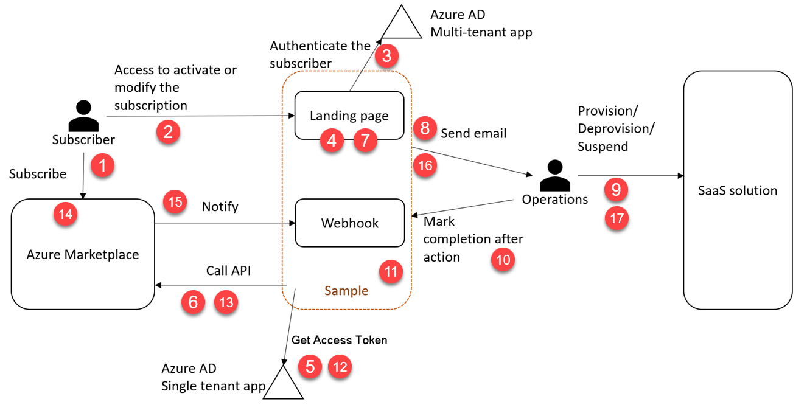

- [Landing Page](https://github.com/Ercenk/ContosoAMPBasic/blob/master/src/Dashboard/Controllers/LandingPageController.cs#L27)
- [Webhook Endpoint](https://github.com/Ercenk/ContosoAMPBasic/blob/master/src/Dashboard/Controllers/WebHookController.cs)
- [Calling the API](https://github.com/Ercenk/ContosoAMPBasic/blob/master/src/Dashboard/Controllers/LandingPageController.cs#L19)

Remember, this scenario is useful when there is a human element in the mix, for
situations such as:

- A script needs to be run manually for provisioning resources for a new
  customer as part of the onboarding process.
- A team needs to qualify the purchase of the customer for reasons like ITAR
  certification, etc.

### Walking-through the Scenario Subscription Process

1. The prospective customer is on the Azure Portal going through the Azure
   Marketplace in-product experience. They find the solution and subscribe to it
   after deciding on a plan. A placeholder resource is deployed on the
   customer's (subscriber's) Azure subscription for the new offer subscription.
   _Note:_ Please notice the overloaded use of the "subscription", there are two
   subscriptions at this moment, the customer's Azure subscription and the
   subscription to the SaaS offer. I will use **subscription** only when I refer
   to the subscription to the offer from now on.
2. Subscriber clicks on the **Configure Account** button on the new
   subscription, and gets transferred to the landing page.
3. Landing page uses Azure Active Directory (with OpenID Connect flow) to log
   the user on.
4. Landing page uses the SDK to resolve the subscription to get the details,
   using the marketplace token on the landing page URL token parameter.
5. SDK gets an access token from Azure Active Directory (AAD).
6. SDK calls **resolve** operation on the Fulfillment API, using the access
   token as a bearer token.
7. Subscriber fills in the other details on the landing page that will help the
   operations team to kick of the provisioning process. The landing page asks
   for a deployment region, as well as the email of the business unit contact.
   The solution may be using different data retention policies based on the
   region (e.g. GDPR in Europe), or the solution may be depending on a
   completely different identity provider (IP), such as something in-house
   developed, and may be sending an email to the business unit owner asking them
   to add the other end users to the solution's account management system.
   Please keep in mind that the person subscribing, that is the purchaser
   (having access to the Azure subscription) can be different than the end users
   of the solution.
8. Subscriber completes the process by submitting the form on the landing page.
   This sends an email to the operations team email address (configured in the
   settings).
9. Operations team takes the appropriate steps (qualifying, provisioning
   resources, etc.).
10. Once complete, operation team clicks on the activate link in the email.
11. The sample uses the SDK to activate the subscription.
12. SDK gets an access token from Azure Active Directory (AAD).
13. SDK calls the `activate` operation on the Fulfillment API.
14. The subscriber may eventually unsubscribe from the subscription by deleting
    it, or may stop fulfilling their monetary commitment to Microsoft.
15. The commerce engine sends a notification on the webhook at this time, to
    notify the publisher know about the situation.
16. The sample sends an email to the operations team, notifying the team about
    the status.
17. The operations team may de-provision the customer.

## Running the Sample

### Creating a Web Application on Azure App Service and Deploy the Sample

I am assuming you have already cloned the code in this repo. Open the solution
in Visual Studio, and follow the steps for deploying the solution starting from
this
[step](https://docs.microsoft.com/en-us/azure/app-service/app-service-web-get-started-dotnet#publish-your-web-app).

The following is how my Visual Studio Publish profile looks:

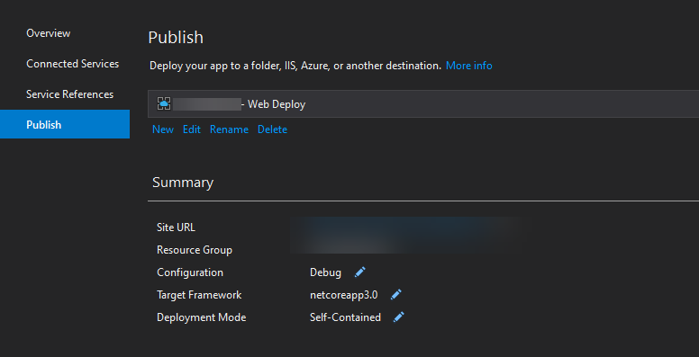

### Registering Azure Active Directory Applications

I usually maintain a separate Azure Active Directory tenant (directory) for my
application registrations. If you want to register the apps on your default
directory, you can skip the following steps and go directly to
[Registering the Apps](#registering-the-apps).

#### Creating a New Directory

1. Login to the [Azure Portal](https://portal.azure.com).
2. Click `Create a Resource` and type in `Azure Active Directory` in the search
   box:

   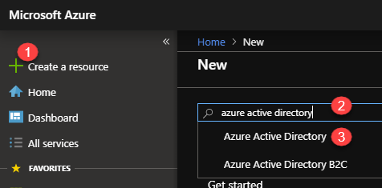

   Select `Create Directory` then fill in the details as you see fit after
   clicking the `Create` button

3. Switch to the new directory.

   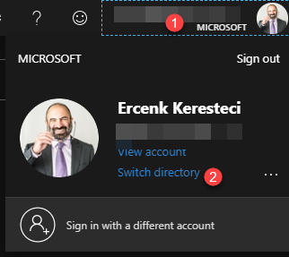

4. Select the new directory, if it does not show under "Favorites" check "All
   directories":

   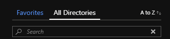

5. Once you switch to the new directory (or if you have not created a new one,
   and decided to use the existing one instead), select the Active Directory
   service (**1** on the image below). If you do not see it, find it using "All
   services" (**2** on the image below).

   

6. Click on "App registrations", and select "New registration". You will need to
   create two apps.

   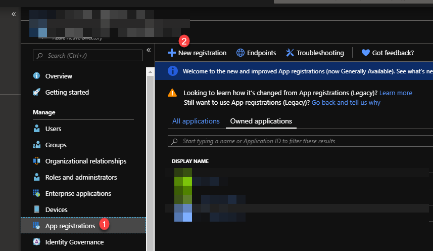

#### Registering the Apps

As I mentioned in the landing page and webhook sections above, I recommend
registering two applications:

1. **For the Landing Page:** Azure Marketplace SaaS offers are required to have
   a landing page, authenticating through Azure Active Directory. Register it as
   described in the
   [documentation](https://docs.microsoft.com/en-us/azure/active-directory/develop/quickstart-v2-aspnet-core-webapp#option-2-register-and-manually-configure-your-application-and-code-sample).
   **Make sure you register a multi-tenant application**, you can find the
   differences in the
   [documentation](https://docs.microsoft.com/en-us/azure/active-directory/develop/single-and-multi-tenant-apps).
   Select the "ID tokens" on the "Authentication" page. Also, add two Redirect
   URLs: the base `/` URL of the web app and another web app URL with
   `/signin-oidc` added.

2. **To authenticate Azure Marketplace Fulfillment APIs,** you can register a
   **single tenant application**.

   

### Creating and configuring a SendGrid account

Follow the steps in the
[tutorial](https://docs.microsoft.com/en-us/azure/sendgrid-dotnet-how-to-send-email),
and grab an API Key. Set the value of the ApiKey in the configuration section,
"Dashboard:Mail", either using the user-secrets method or in the appconfig.json
file.

### Creating a storage account

Create an Azure Storage account following the steps
[here](https://docs.microsoft.com/en-us/azure/storage/common/storage-account-create?tabs=azure-portal).
The solution uses the storage account to keep references to the operations
returned by actions done on the fulfillment API.

### Change the configuration settings

You will need to modify the settings with the values for the services you have
created above.

You will need to replace the values marked as "CHANGE" or "SET USING dotnet
user-secrets" in the appsettings.json file.

For those values marked with "SET USING dotnet user-secrets" you can either plug
the values in the appsettings.json file, or use the dotnet user-secrets command.
Please see the section "Secrets" below for the details if you want to use user
secrets method.

| Setting                                           | Change/Keep | Notes                                                                                                                                                                                                         |
| ------------------------------------------------- | ----------- | ------------------------------------------------------------------------------------------------------------------------------------------------------------------------------------------------------------- |
| AzureAd:Instance                                  | Keep        | The landing page is using a multi-tenant app. Keep the instance value                                                                                                                                         |
| AzureAd:Domain                                    | Change      | You can find this value on the "Overview" page of the Active Directory you have registered your applications in. If you are not using a custom domain, it is in the format of \<tenant name\>.onmicrosoft.com |
| AzureAd:TenantId                                  | Keep        | Common authentication endpoint, since this is a multi-tenant app                                                                                                                                              |
| AzureAd:ClientId                                  | Change      | Copy the clientId of the multi-tenant app from its "Overview" page                                                                                                                                            |
| AzureAd:CallbackPath                              | Keep        | Default oidc sign in path                                                                                                                                                                                     |
| AzureAd:SignedOutCallbackPath                     | Keep        | Default sign out path                                                                                                                                                                                         |
| FulfillmentClient:AzureActiveDirectory:ClientId   | Change      | Copy the clientId of the single-tenant app from its "Overview" page. This AD app is for calling the Fulfillment API                                                                                           |
| FulfillmentClient:AzureActiveDirectory:TenantId   | Change      | Copy the tenantId of the single-tenant app from its "Overview" page.                                                                                                                                          |
| FulfillmentClient:AzureActiveDirectory:AppKey     | Change      | Go to the "Certificates & secrets" page of the single-tenant app you have registered, create a new client secret, and copy the value to the clipboard, then set the value for this setting.                   |
| FulfillmentClient:FulfillmentService:BaseUri      | Keep        | The Azure Marketplace API endpoint.                                                                                                                                                                           |
| FulfillmentClient:FulfillmentService:ApiVersion   | Change      | Change if you want to hit the production or mock API. 2018-08-31 is for production, 2018-09-15 is for mock API                                                                                                |
| FulfillmentClient:OperationsStoreConnectionString | Change      | Copy the connection string of the storage account you have created in the previous step. Please see [SDK documentation for details](https://github.com/Ercenk/AzureMarketplaceSaaSApiClient#operations-store) |
| Dashboard:Mail:OperationsTeamEmail                | Change      | The sample sends emails to this address.                                                                                                                                                                      |
| Dashboard:Mail:FromEmail                          | Change      | Sendgrid requires a "from" email address when sending emails.                                                                                                                                                 |
| Dashboard:Mail:ApiKey                             | Change      | Sendgrid API key.                                                                                                                                                                                             |
| Dashboard:DashboardAdmin                          | Change      | Change it to the email address you are logging on to the dashboard. Only the users with the domain name of this email is authorized to use the dashboard to display the subscriptions.                        |
| Dashboard:ShowUnsubscribed                        | Change      | Change true or false, depending on if you want to see the subscriptions that are not active.                                                                                                                  |

### Create an Offer on Commercial Marketplace Portal in Partner Center

Once your AAD directory, AAD applications, and web application are setup and
ready to use, an offer must be created in the
[Commercial Marketplace Portal in the Microsoft Partner Center](https://partner.microsoft.com/en-us/dashboard/home).

Documentation on creating an offer can be found on
[Microsoft Docs: Create a New Saas Offer in the Commercial Marketplace](https://docs.microsoft.com/en-us/azure/marketplace/partner-center-portal/create-new-saas-offer).
Documentation is also available for all
[fields and pages for the offer on Docs](https://docs.microsoft.com/en-us/azure/marketplace/partner-center-portal/offer-creation-checklist)
as well.

You will need the following information to complete the offer:

- AAD Application ID (also called Client ID) from the Single-Tenant Application
- AAD Tenant ID hosting the AAD Single Tenant
- URLs from the Azure AppService web application:
  - The Base URL `/`
  - The Landing Page `/landingpage`
  - The Webhook Endpoint `/webhook`
  - The Privacy Policy `/privacy`
  - The Support Page `/support`
- Storage Account Connection String

Additionally, you will need assets, such as logos and screenshots, to complete
the offer listing as well. They can be found in this code repository under
`/resources`.

### Example Offer Setup in Commercial Marketplace Portal

These are sample configuration values for the offer to pass certification of the
sample SaaS solution to help you get started with a sample offer.

> **:warning: IMPORTANT:** This is just meant to be a sample. You will need to
> make adjustments based on your specific offer, even for this sample (e.g.
> contact information). _Real_ information needs to be entered; using "Lorem
> ipsum" style information will _not_ pass the certification steps if you want
> to preview your offer in the marketplace. Again, reference the
> [Microsoft Docs](https://docs.microsoft.com/en-us/azure/marketplace/partner-center-portal/create-new-saas-offer)
> for a more thorough overview of each section.

#### Offer Setup

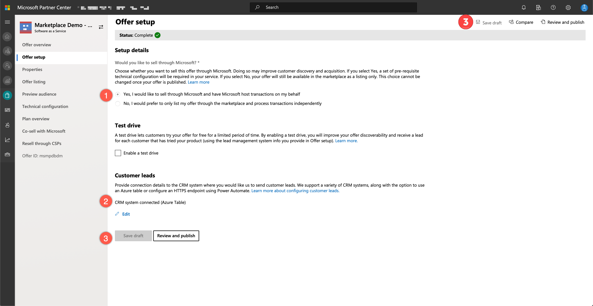
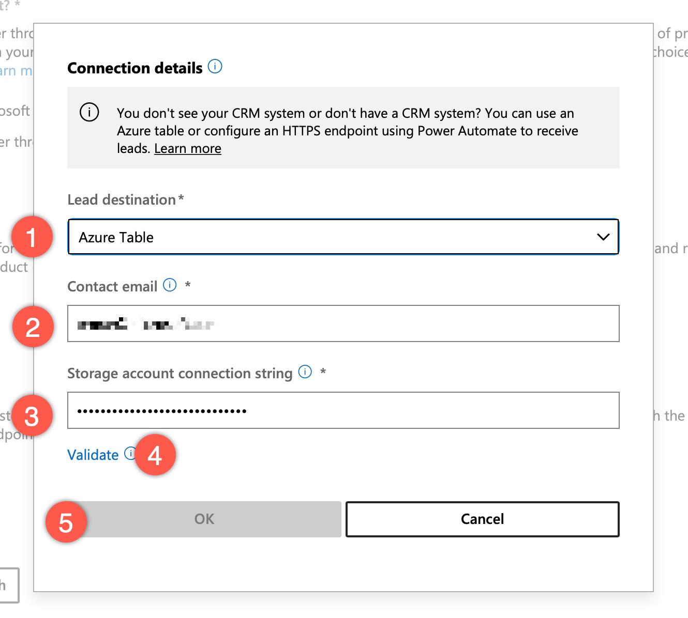

#### Properties

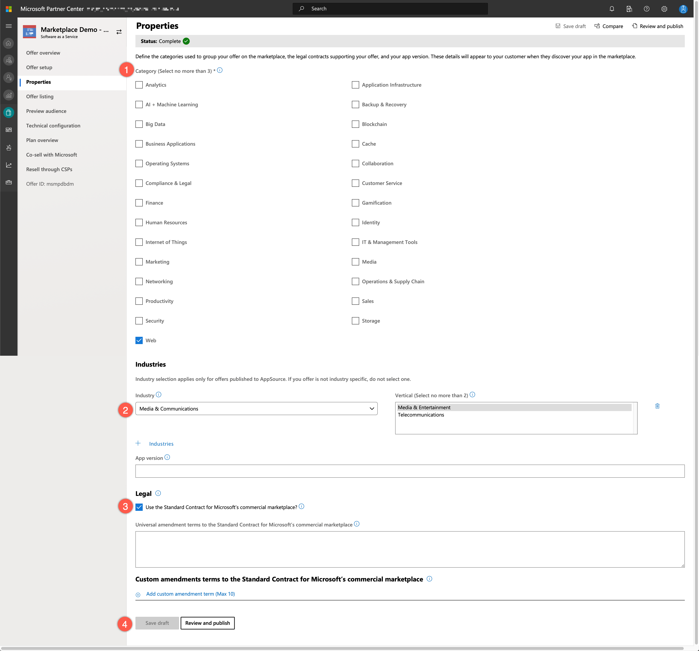

#### Offer Listing

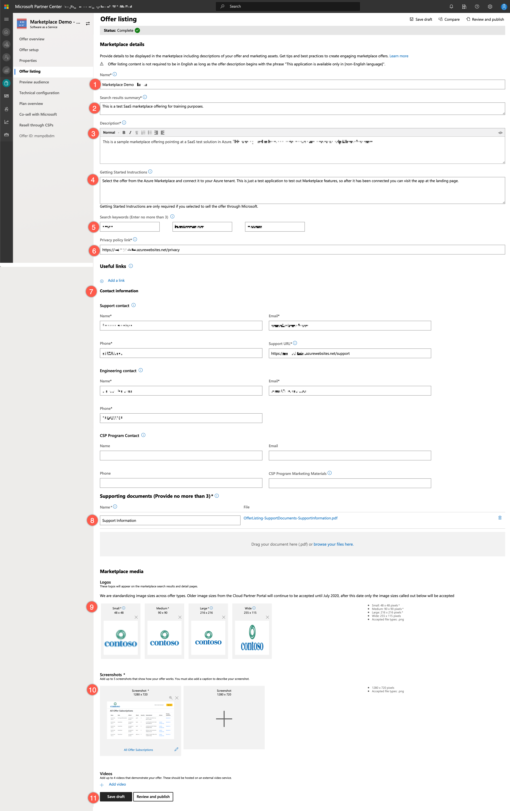

#### Preview Audience

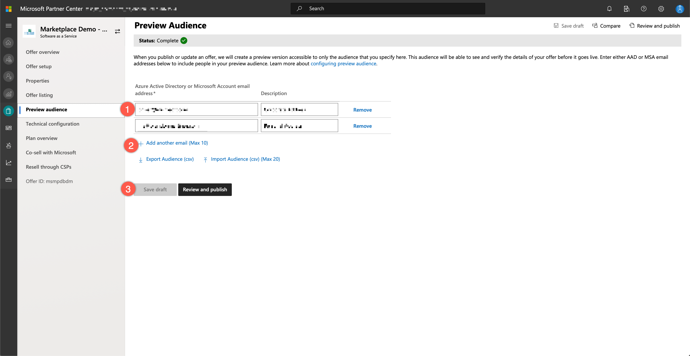

#### Technical Configuration

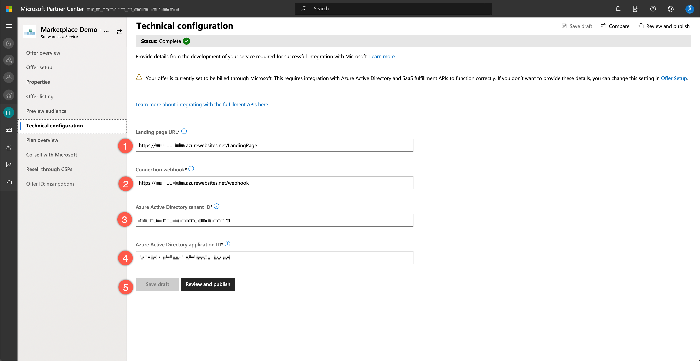

#### Plan Overview

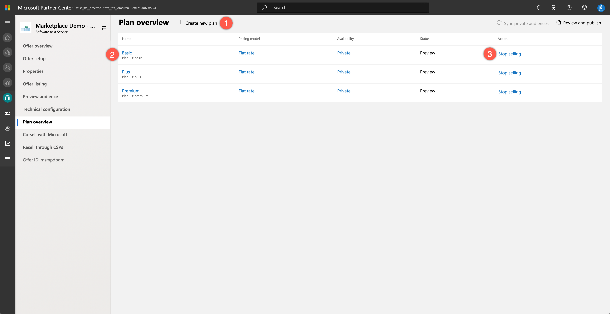

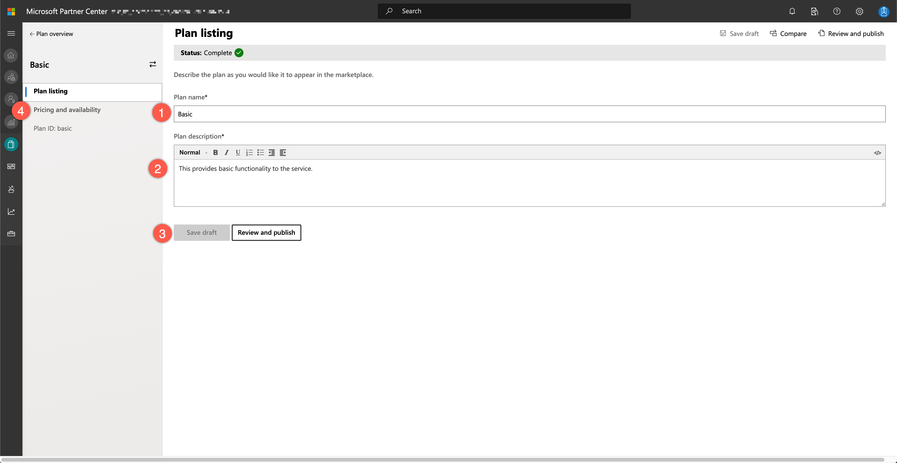

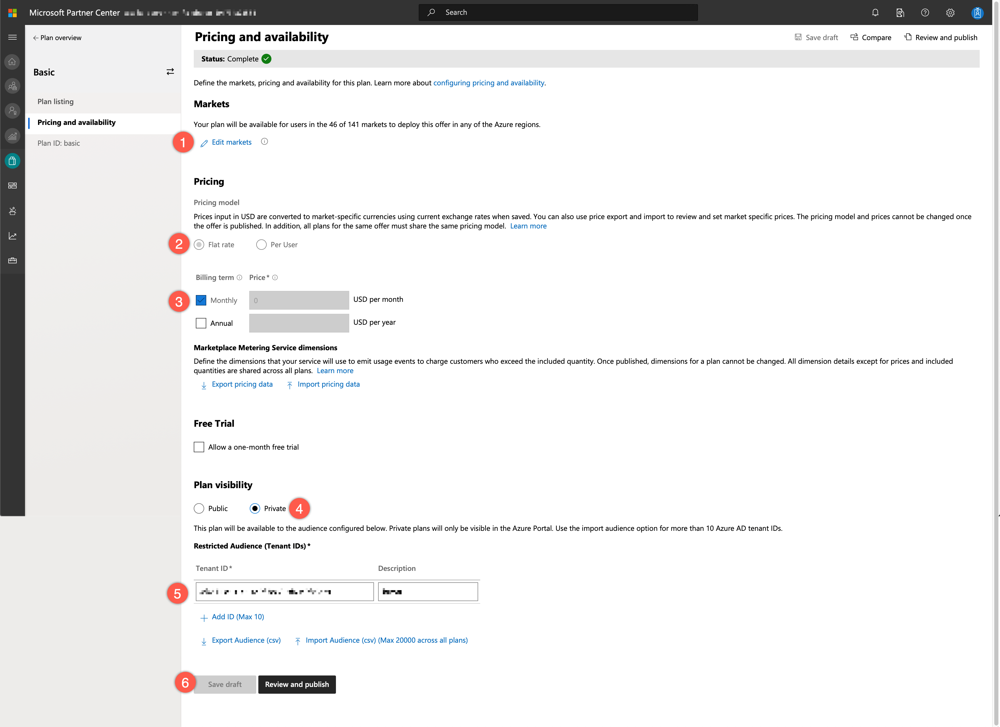

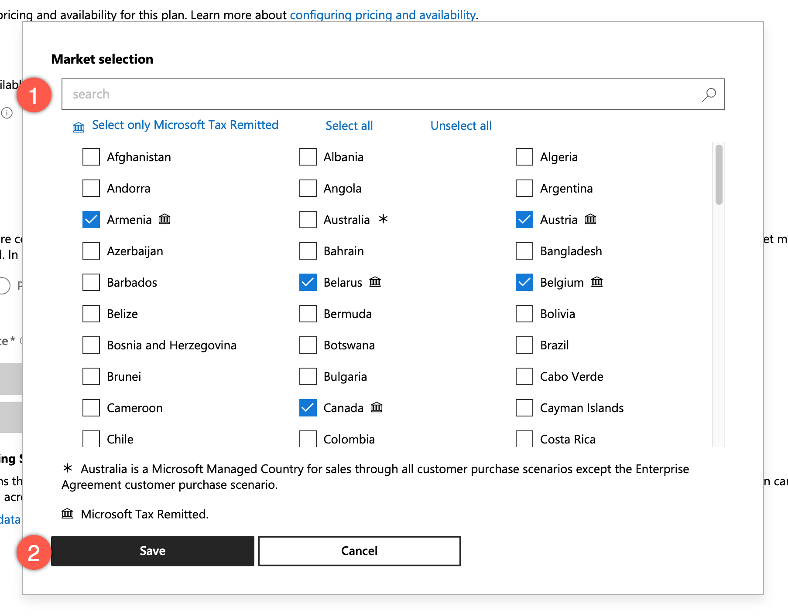

#### Co-Sell with Microsoft

*Nothing needs to be configured here for the purpose of this solution.*

#### Resell Through CSPs

*Nothing needs to be configured here for the purpose of this solution.*

You will need to provide the application ID (also referred to as the "client
ID") and the tenant ID on the
["Technical Configuration page"](https://docs.microsoft.com/en-us/azure/marketplace/partner-center-portal/offer-creation-checklist#technical-configuration-page)
on the Partner portal while registering your offer. Copy the tenant ID and the
client ID of the single tenant application you created (the second app) and set
them on the technical configuration page.

Copy the base URL of the web application, and set the value of the landing page,
by adding `/landingpage` to the end, and set the webhook URL by adding
`/webhook` to the end of the base URL of the web application.

Also create test plans, with \$0 cost, so you do not charge yourself when
testing. Please remember to add a list of users as authorized preview users on
the "Preview" tab.

## Signing Up for Your Offer

Customer searches for the offer on Azure Portal

1. Go to Azure Portal and add a resource


2. Find the search text box

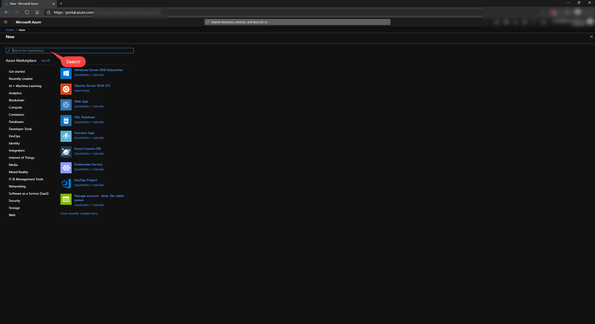

3. Type in your offer name


4. Select the plan

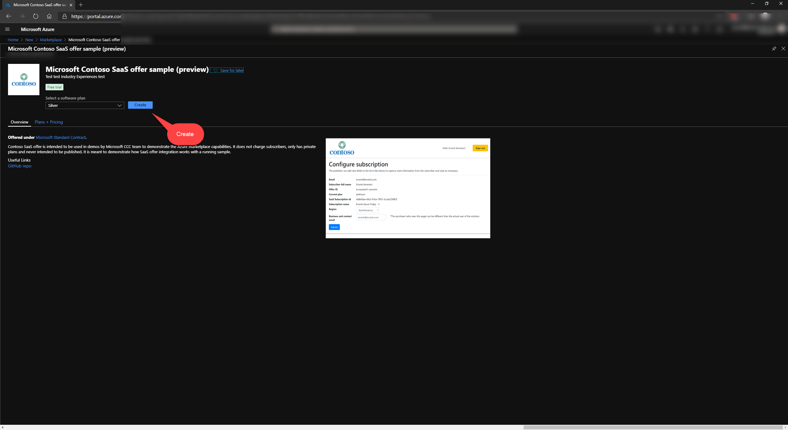

5. Subscribe


6. Find the subscription after the deployment is complete, and go the
   subscription


7. Subscription details, notice it is not active yet


8. Landing page

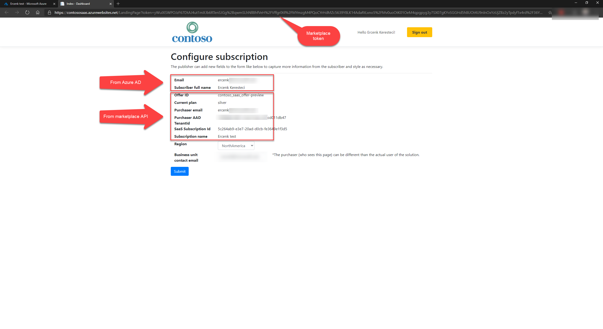

9. Purchaser submits the form, and Contoso ops team receives an email

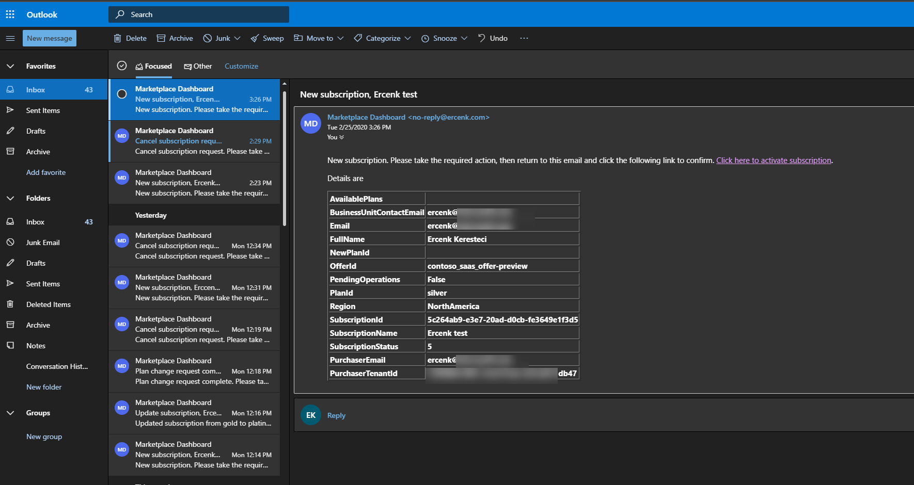

10. Contoso team takes the appropriate action to qualify and onboard the
    customer

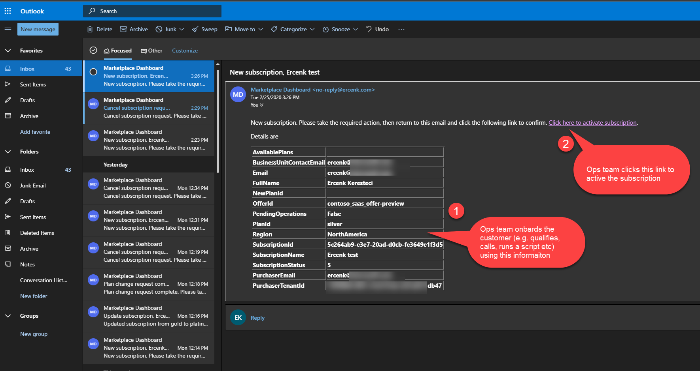

## Notes

### Secrets

Secrets such as API keys are managed through "dotnet user-secrets" command. For
example, to set the value for "FulfillmentClient:AzureActiveDirectory:AppKey"
use the following command:

```shell
dotnet user-secrets set "FulfillmentClient:AzureActiveDirectory:AppKey" "secret here"
```

Please see the user secrets
[documentation](https://docs.microsoft.com/en-us/aspnet/core/security/app-secrets?view=aspnetcore-2.2&tabs=windows)
for more details.

Alternatively, if you are not going to publish your code, and will just keep the
code on your computer, you can also modify the appsettings.json to add your
secrets.

#### An experimental API client, and webhook processor helper

I have an experimental API client I posted on a different repo that implements
the API interactions as well as encapsulates the webhook interaction. Please
take a look at this
[repo](https://github.com/Ercenk/AzureMarketplaceSaaSApiClient).
